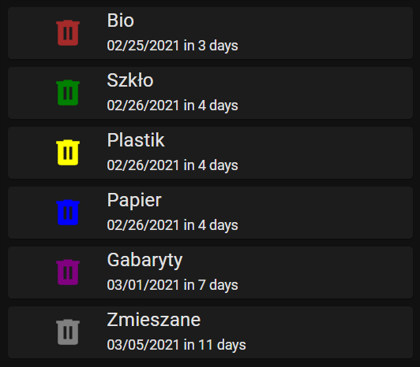

# goap-home-assistant
[GOAP](https://www.goap.org.pl/) collection schedule in Home Assistant

## Before you begin
Make sure you get a collection schedule for your address [on this website](https://web.c-trace.de/zmgoappoznan-abfallkalender/kalendarzodpadow)

## Installation
1. Install the following components from [HACS](https://github.com/hacs/integration):
    - [PyScript](https://github.com/custom-components/pyscript)
    - [Garbage Collection Card](https://github.com/amaximus/garbage-collection-card)
    - [layout-card](https://github.com/thomasloven/lovelace-layout-card)
    - [auto-entities](https://github.com/thomasloven/lovelace-auto-entities)
    - [card-mod](https://github.com/thomasloven/lovelace-card-mod)
2. Enable ```Allow all imports``` option in PyScript settings (Configuration -> Integrations -> PyScript -> Options)
3. Copy the ```pyscript``` folder from this repository into your Home Assistant configuration folder. Alternatively, you can run the following commands:
    >Make sure you are in your HA config folder (the one with ```configuration.yaml``` inside)

    ```
    git clone https://github.com/krygacz/goap-home-assistant.git goap
    cp -r ./goap/pyscript ./
    rm -rf ./goap
    ```
4. Open ```pyscript/goap.py``` with your favorite text editor and follow the instructions there to edit configuration

5. Add the following card to your lovelace dashboard:
    ```yaml
    type: 'custom:auto-entities'
    filter:
      include:
        - entity_id: sensor.goap_*
          options:
            type: 'custom:garbage-collection-card'
            title_size: 15px
            icon_size: 35px
            style: |
              ha-icon-button {
                color: {{state_attr('this.entity_id', 'icon_color')}};
              }
    sort:
      method: attribute
      attribute: days
    card:
      type: 'custom:layout-card'
    ```
    Here's how it should look like:
    
    

## 